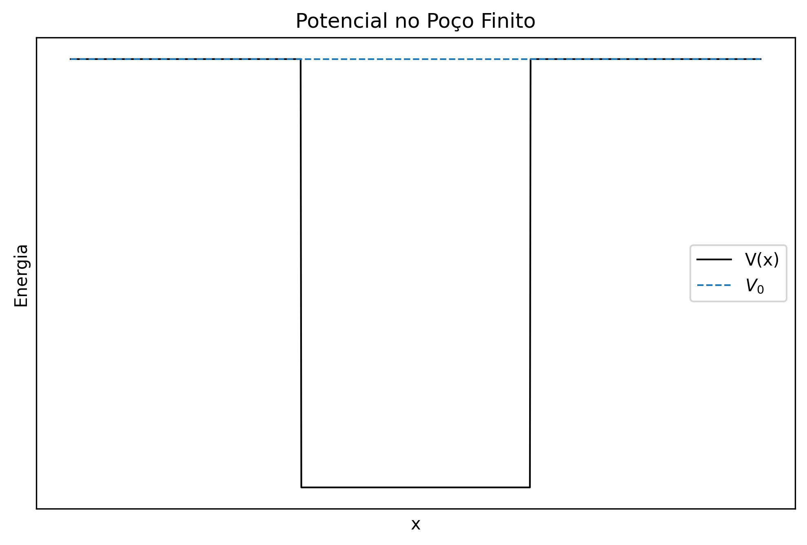
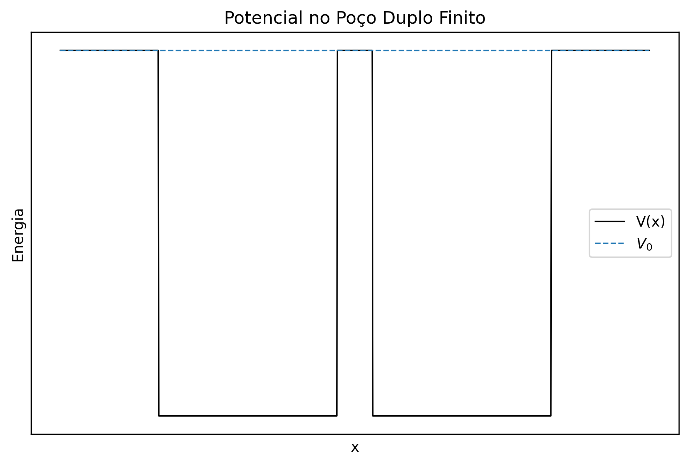
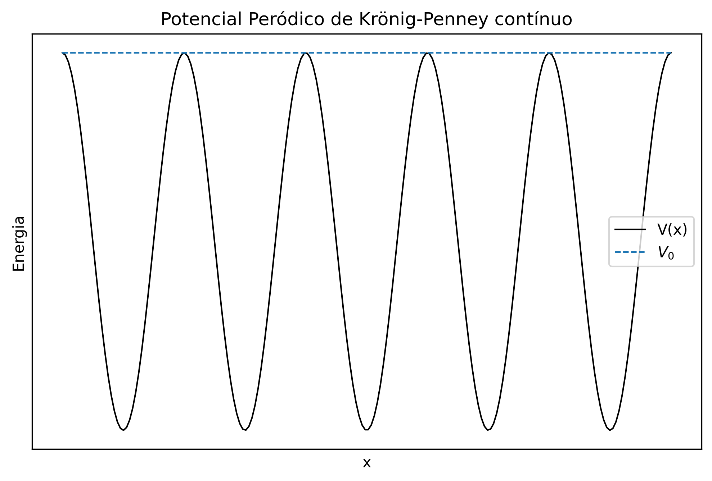
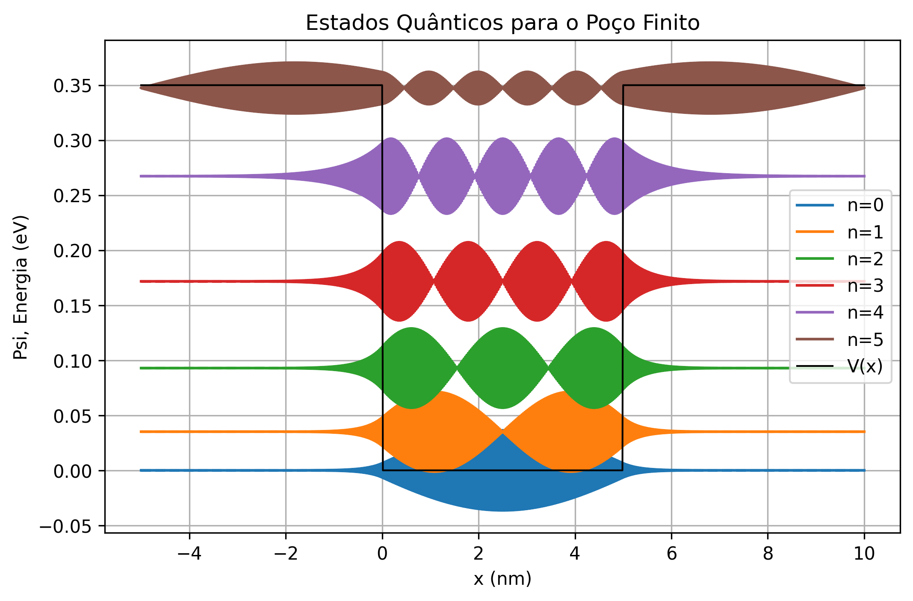
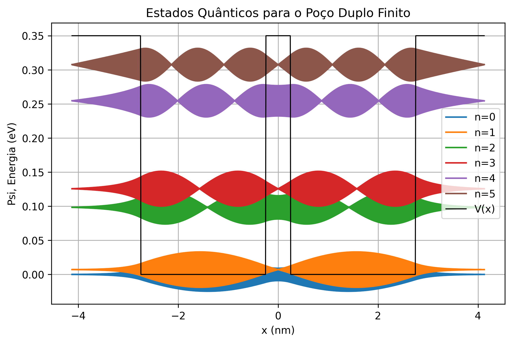
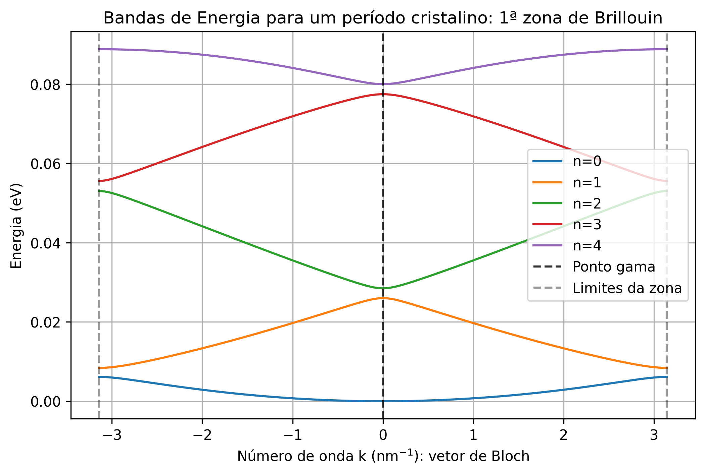

<h1 align="center">Modelagem da Equação de Schrödinger unidimensional independente do tempo</h1>

O presente trabalho foi apresentado como projeto final da disciplina de Equações Diferenciais do segundo semestre do curso de Bacharelado Interdisciplinar em Ciência e Tecnologia da Ilum - Escola de Ciência ministrada pelo pesquisador Vinicius Francisco Wasques.

## Resumo

A equação de Schrödinger fornece o arcabouço teórico para descrever estados eletrônicos em sistemas quânticos, desempenhando um papel central no estudo de materiais. Sua análise costuma iniciar por modelos simplificados — toy models de átomos, moléculas e cristais — que funcionam como protótipos conceituais de crescente complexidade. Muitos potenciais de interesse, porém, inviabilizam soluções analíticas, tornando métodos numéricos indispensáveis. Entre eles, abordagem por Diferenças Finitas destaca-se por permitir a discretização direta da equação para qualquer forma de potencial. Este trabalho implementa, em Python, o método de Diferenças Finitas aplicado aos modelos do Poço Finito, Poço Duplo e Krönig–Penney contínuo, utilizando condições de contorno de Dirichlet ou de Bloch conforme apropriado. Os resultados obtidos reproduzem as características físicas esperadas desses sistemas, indicando que a implementação numérica foi bem-sucedida.

## Conteúdos do repositório

  
 Este repositório possui todos os códigos - em notebooks jupyter - necessários para realizar a modelagem da equação de Schrödinger unidimensional e independente do tempo. 

  <ul>
    <li> :page_facing_up: poço.ipynb: Arquivo com o código para modelagem do Poço Finito; </li>
    <li> :page_facing_up: poço_duplo.ipynb: Arquivo com o código para modelagem do Poço Duplo Finito; </li>
    <li> :page_facing_up: kronig-penney.ipynb: Arquivo com o código para modelagem do Krönig-Penney contínuo; </li>
    <li> :file_folder: Resultados: Contém as imagens obtidas como resultados das modelagens; </li>
    <li> :framed_picture: Cabeçalho.png: Imagem usada para o cabeçalho do README. </li>
  </ul>

**Palavras-chave**. Modelagem, Quântica, Diferenças Finitas, Equação de Schrödinger, Poço Finito, Poço Duplo, Krönig-Penney

## Introdução

Inspirado pelas relações de de Broglie de Planck-Einstein, Erwin Schrödinger, em 1926, publicou uma série de artigos nos quais desenvolveu a Mecânica Quântica Ondulatória. Sua famosa equação descreve o comportamento de estados eletrônicos, logo, tornou-se fundamental para qualquer estudo na área de materiais. Em sua versão mais completa, é a seguinte:

$$
i\hbar \frac{\partial}{\partial t}\Psi(\vec r,t)
= -\frac{\hbar^{2}}{2m}\nabla^{2}\Psi(\vec r,t) + V(\vec r,t)\Psi(\vec r,t)
$$

 Em que Ψ(r, t) é uma função de onda que descreve o elétron e depende da posição (r) e do tempo (t); V é a função da energia potencial; m é a massa do elétron; ℏ é a constante de Planck reduzida; i é a unidade imaginária. 

 Essa equação é categorizada como uma Equação Diferencial Parcial (EDP), pois depende de três coordenadas espacias mais uma temporal. No entanto, quando o potencial independe do tempo, a função de onda pode ser escrita como a multiplicação de duas partes: espacial e temporal. Dessa forma, ela pode ser dividida em duas. Apenas a equação independente do tempo reduzida para uma dimensão será estudada, pois se enquadra como uma Equação Diferencial Ordinária (foco de estudo da disciplina) que se dá por: 

$$
    -\frac{\hbar^{2}}{2m}\frac{\mathrm d^2 \psi(x)}{\mathrm d x^2}
    + V(x)\psi(x)
    =
    \mathrm E  \psi(x)
$$

Essa equação se resume a um problema de álgebra linear de autofunções e autovalores em que o operador, chamado Hamiltoniano, se dá pela soma dos termos de energias cinética e potencial:

$$
    \hat H = \left( -\frac{\hbar^{2}}{2m}\frac{\mathrm d^2}{\mathrm d x^2}
    + V(x) \right)
$$

Portanto, a equação pode ser reescrita como:

$$
\hat H\psi(x) =
\mathrm E \psi(x)
$$

Com essa equação, é possível calcular os valores permitidos de energia para o elétron em um dado potencial, bem como as funções de onda correspondentes. Estas não possuem um real significado físico (na interpretação de Copenhague), pois são objetos matemáticos abstratos presentes no espaço de Hilbert. O que a física interpreta vem da regra de Born: |ψ(x)|2 é uma função densidade de probabilidade da posição do elétron e descreve - em certa medida - orbitais [1].

### Objetivo 

O presente trabalho tem como objetivo estudar três diferentes <em>toy models</em> para aplicação: poço finito, poço duplo finito, Krönig-Penney contínuo. 

  
  
  

  <em>(a) Poço finito &nbsp;&nbsp;&nbsp; 
      (b) Poço duplo &nbsp;&nbsp;&nbsp; 
      (c) Kronig-Penney contínuo</em>

  <strong>Figura:</strong> Imagens ilustrativas das formas de potenciais.

#### Poço Finito

O poço finito representa, de forma bem simplificada, um átomo de hidrogênio, pois permite estudar um objeto quântico confinado tal qual um elétron preso ao núcleo [1]. Ele consiste em um potencial que tem o valor V0 constante para todo x, exceto por um trecho que possui valor zero, como mostra a Figura 1 a).

#### Poço Duplo Finito

Se o poço finito representa um átomo de hidrogênio, o poço duplo finito representa uma molécula de H2+, usado para modelar o confinamento de um elétron - um objeto quântico - nessa molécula diatômica [1]. Ele consiste em um potencial que tem o valor V0 constante para todo x, exceto por dois trechos nos quais possui valor zero, como mostra a Figura 1 b).

#### Krönig-Penney Contínuo

O modelo de Krönig-Penney contínuo representa uma rede cristalina de átomos, usado para modelar materiais cristalinos simples [1]. Basicamente, este modelo é a extensão dos dois anteriores, pois considera infinitos poços. Com este modelo unidimensional peródico, já é possível identificar características de materiais cristalinos, como vetor de Bloch, zonas de Brillouin e bandas de energia - incluindo <em>gaps</em> [1]. Ele consiste em um potencial cossenoidal cuja amplitude tem o valor V0, como mostra a Figura 1 c).

## Metodologia

Serão apresentadas agora as etapas realizadas para a modelagem computacional dos problemas. 

### Aplicando o Método das Diferenças Finitas

O método numérico escolhido para aproximação dos problemas foi o método das Diferenças Finitas, que oferece uma aproximação para as derivadas e permite que a equação diferencial seja representada por matrizes. A primeira etapa da modelagem, portanto, foi aplicar o método das diferenças finitas à Equação de Schrödinger unidimensional e independente do tempo. Pelo método das diferenças finitas, a aproximação para a derivada de segunda ordem é: 

$$
\frac{X_{i-1} - 2X_{i} + X_{i+1}}{\ell^2}
$$

Assim, tem-se: 

$$
-\frac{\hbar^2}{2m}\bigg[\frac{\psi_{i-1} - 2\psi_{i} + \psi_{i+1}}{\ell^2}\bigg] + V(x) \psi_i = E\psi_i 
$$

Essa equação pode ser reescrita na forma da matriz que multiplica ψ, um vetor que guarda as funções ψi: 

$$
\hat{H}_{df}= -\frac{\hbar^2}{2m\ell^2}
\begin{bmatrix}
-2 & 1 & 0 & \cdots & 0 \\
1 & -2 & 1 & \cdots & 0 \\
0 & 1 & -2 & \ddots & 0 \\
\vdots & \ddots & \ddots & \ddots & 1 \\
0 & 0 & 0 & 1 & -2
\end{bmatrix} + V(x) I
$$

O operador Ĥdf é a aproximação do Hamiltoniano (Ĥ) no método das diferenças finitas. Assim, as próximas etapas resolverão o problema de autovalor: 

$$
\hat{H}_{df}\psi=E\psi
$$

### Determinando as Condições de Contorno de Cada Problema

O problema de autovalor é geral aos problemas. Assim, os diferentes resultados para cada problema serão dados pela aplicação das condições de contorno e potenciais específicos.

Para modelar os potenciais no poço finito e no duplo poço finito, foram usadas funções por partes. Além disso, a condição de contorno utilizada foi a de Dirichlet, em que as funções inicial e final são conhecidas.

Para modelar o potencial de Krönig-Penney contínuo foi usada uma função cosseno.

$$
V(x) = V_0 \cos{\bigg(\frac{2 \pi x}{a}\bigg)}
$$

Em que a é o período espacial do cristal. Ademais, a condição de contorno utilizada foi a periódica de Bloch, que consiste em afirmar:

$$
\psi(x) = \psi(x + a)
$$

Essa relação estabelece a periodicidade. Dela retira-se um Hamiltoniano ligeiramente diferente, com exponenciais complexos nos cantos superior direito e inferior esquerdo [1].

$$
\hat{H}_{df}= -\frac{\hbar^2}{2m\ell^2}
\begin{bmatrix}
-2 & 1 & 0 & \cdots & e^{-ika} \\
1 & -2 & 1 & \cdots & 0 \\
0 & 1 & -2 & \ddots & 0 \\
\vdots & \ddots & \ddots & \ddots & 1 \\
e^{ika} & 0 & 0 & 1 & -2
\end{bmatrix} + V(x)\,I
$$

Em que k é chamado vetor de Bloch. Para a física, o importante sobre ele é que o intervalo [−π/a, π/a] de valores de k para estruturas unidimensionais determina a primeira zona de Brillouin. Esta zona é repetida na periodicidade do cristal, portanto basta estudar a estrutura de bandas de energia nela para compreender o todo [1].

### Modelagem Computacional em Python

Com as condições de cada problema determinadas, o passo final foi construir o problema em Python. A primeira etapa para modelagem de cada caso foi a definição das constantes físicas, números de pontos da malha e o passo ℓ. Em sequência, foram utilizadas as bibliotecas <em>numpy</em> e <em>scipy</em> para definir os potenciais e construir os operadores Ĥdf. Enfim, eram aplicadas as condições de contorno e feita a solução do problema de autovalor e autofunção também pelo <em>scipy</em>. Os gráficos dos resultados foram apresentados com auxílio do módulo <em>matplotlib</em>.

## Discussão

Foi possível calcular as funções de onda e as energias para os três modelos diferentes utilizando o método das diferenças finitas e duas condições de contorno diferentes (Dirichlet e Bloch). Com valores arbitrários, porém possíveis fisicamente, obteve-se três gráficos como resultado: um para cada modelo.

  
  
  

  <em>(a) Poço finito &nbsp;&nbsp;&nbsp; 
      (b) Poço duplo finito &nbsp;&nbsp;&nbsp; 
      (c) Krönig-Penney contínuo</em>

  <strong>Figura:</strong> Resultados obtidos. Em a) e b) observa-se as funções de onda em seus respectivos níveis energéticos. Em c) observa-se bandas de energia.

Os gráficos mostram o comportamento esperado para cada modelo [1]. No poço finito é possível identificar versões unidimensionais de orbitais e seus nódulos. No poço duplo é possível identificar sobreposição ímpar e par de orbitais. No modelo de Krönig-Penney é possível identificar a estrutura de bandas e <em>gaps</em> de energia.

## Considerações Finais

Com o intuito de estudar numericamente a equação de Schrödinger unidimensional e independente do tempo, foram analisados três modelos simplificados amplamente utilizados na descrição conceitual de sistemas eletrônicos: o poço finito, o poço duplo e o modelo de Krönig–Penney contínuo. A discretização por diferenças finitas mostrou-se adequada para tratar cada caso, desde que acompanhada das condições de contorno apropriadas — Dirichlet para os potenciais localizados e as condições de Bloch para o potencial periódico. Os espectros obtidos reproduziram os comportamentos físicos característicos desses sistemas: funções de onda representativas de orbitais no poço finito; sobreposição de funções de onda e estados ligados no poço duplo; e formação de bandas permitidas e proibidas, e até mesmo <em>band gaps</em> no potencial periódico. Esses resultados indicam que a implementação em Python do método de diferenças finitas e das condições de contorno foi consistente e eficaz na reconstrução das propriedades essenciais de cada modelo.

## Referência Teórica

[1] DATTA, Supriyo. Quantum transport: atom to transistor. 1. ed. New York: Cambridge University Press, 2005.

## Professor orientador

<table>
  <tr>
    <td align="center">
      <a href="#" title="Prof. Dr. Vinicius F. Wasques">
         
          <a href="https://github.com/viniciuswasques"><b>Prof. Dr. Vinicius F. Wasques<b></a>
      </a>
    </td>
  </tr>
</table>

## Autores

<table>
  
  <tr>
  <td align="center">
      <a href="#" title="Aniel de S. R. Neto">
         
        <a href="https://github.com/AnielNeto"><b>Aniel de S. R. Neto</b></a>
      </a>
    </td>

  <td align="center">
      <a href="#" title="Giulio O. S. R. César">
         
        <a href="https://github.com/Giulio-Roux"><b>Giulio O. S. R. César</b></a>
      </a>
    </td>
  
  <td align="center">
      <a href="#" title="Joaquim J. F. Fonseca">
         
        <a href="https://github.com/JoaquimJFF"><b>Joaquim J. F. Fonseca</b></a>
      </a>
    </td>
    
  </tr>
</table>

